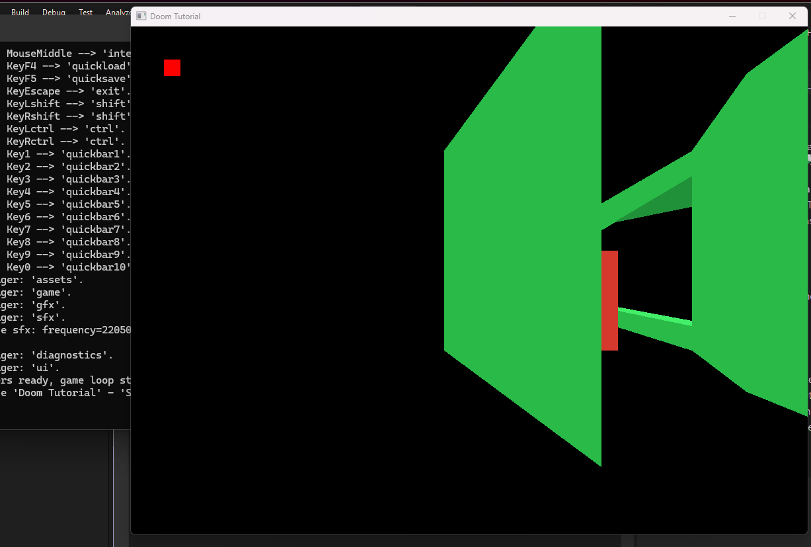

# DoomTutorial
The C# Version ported to BonEngine and SDL2, from jeuxdemains simple raster engine.

This is a simple implementation of a Doom style engine.
[Doom Tutorial YouTube](https://www.youtube.com/watch?v=p7f9p9nDsmc) by [The Old School Coder](https://www.youtube.com/@TheOldSchoolCoder). Original work by [jeuxdemains on GitHub](https://github.com/jeuxdemains)

# Resources
This project is ported to C# using the BonEngine and SDL2.

## BonEngine
[BonEngine](https://github.com/RonenNess/BonEngine) is a game engine designed to be simple and straightforward, with as little setup as possible.
[BonEngineSharp](https://github.com/RonenNess/BonEngineSharp) is a C# bind of BonEngine. The APIs are nearly identical, so in this doc we'll only cover few examples and not the whole API.

[Doom Wiki](https://doomwiki.org/wiki/Main_Page)

